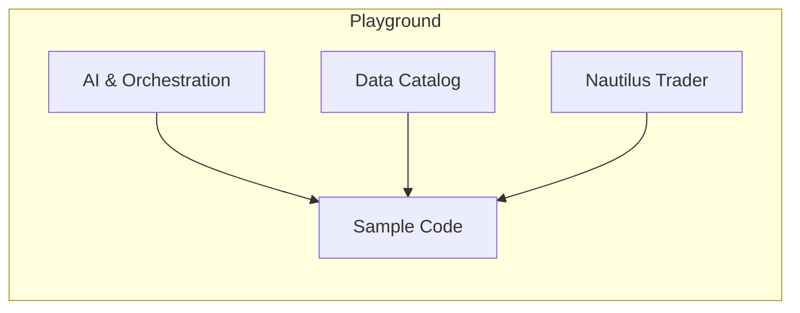
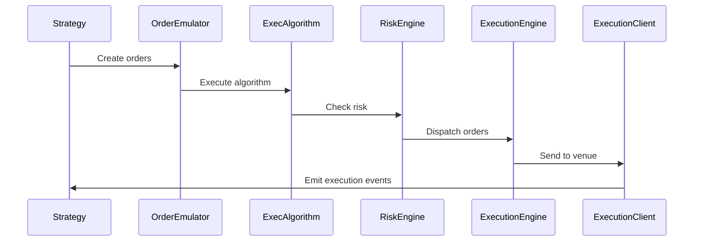

# Nautilus Playground Technical Documentation

## Table of Contents
1. [Technical Overview](#technical-overview)  
   1. [Purpose & Pillars](#purpose--pillars)  
   2. [High-Level Architecture](#high-level-architecture)  
2. [System Requirements](#system-requirements)  
3. [Nautilus Trader Framework](#nautilus-trader-framework)  
   1. [Key Features](#key-features)  
   2. [Core Concepts](#core-concepts)  
   3. [Actor Model & Execution Flow](#actor-model--execution-flow)  
4. [Implementation Details](#implementation-details)  
   1. [Strategy Development](#strategy-development)  
   2. [Order Management](#order-management)  
   3. [Data Access](#data-access)  
   4. [Backtesting](#backtesting)  
5. [Orchestration & Toolchain](#orchestration--toolchain)  
6. [Development Environment](#development-environment)  
7. [Testing & Quality Assurance](#testing--quality-assurance)  
8. [References](#references)  

## 1. Technical Overview
### 1.1 Purpose & Pillars  
The Nautilus Playground provides a cohesive, AI-first, event-driven environment for prototyping, testing, and demonstrating algorithmic trading strategies built atop the Nautilus Trader library.  
- **AI-first**: Emphasizes correctness and safety via Rust-backed components and type safety.  
- **Event-driven**: Components communicate via message passing and an actor model.  
- **Reproducibility**: Local data catalog ensures consistent results.  
- **Modularity**: Clear separation of concerns (execution, indicators, strategies, orchestration).  

### 1.2 High-Level Architecture  
Directory layout:
```text
/workspaces/nautilus-playground/
├── .ai/                        AI artifacts and drafts
├── .roo/                       Orchestration & toolchain metadata
├── data/                       Local data catalog
│   └── catalog/                Reproducible datasets
├── nautilus/                   Nautilus Trader docs & examples
│   ├── docs/
│   └── examples/
├── src/                        Sample implementations
│   ├── execution/
│   ├── indicators/
│   ├── notebooks/
│   ├── strategies/
│   ├── main_live.py
│   ├── main_backtest.py
│   └── run_example.py
└── scripts/
    └── download_data.py
```



## 2. System Requirements
- **Python**: 3.12 (compatible with 3.8+)  
  ```bash
  pip install -U nautilus_trader
  pip install -U nautilus_trader --index-url=https://packages.nautechsystems.io/simple
  ```
- **Rust**: 1.70+ (for building native components)  
- **Docker**: 20.10+ (for consistent environments)  
  ```bash
  docker run -p 8888:8888 ghcr.io/nautechsystems/jupyterlab:nightly
  ```
- **JupyterLab**: 3.x+  
- **Git**: 2.30+  
- **VS Code Dev Container**: Python 3.12, Neovim/NvChad integration  

## 3. Nautilus Trader Framework
### 3.1 Key Features
- **Fast**: Core in Rust with async networking.  
- **Reliable**: Type & thread safety.  
- **Portable**: Cross-platform.  
- **Flexible**: Modular adapters for REST/WebSocket.  
- **Advanced**: Multiple order types and execution instructions.  

### 3.2 Core Concepts
- **Environment Contexts**:  
  - _Backtest_: Historical data, simulated venues  
  - _Sandbox_: Real-time data, simulated venues  
  - _Live_: Real or paper trading  
- **Data Types**:  
  - `OrderBookDelta`, `QuoteTick`, `TradeTick`, `Bar`  
  - `MarketOrder`, `LimitOrder`, `StopMarketOrder`  
  - `PositionOpened`, `PositionChanged`, `PositionClosed`  

### 3.3 Actor Model & Execution Flow
Nautilus Trader uses an actor-based model:


## 4. Implementation Details
### 4.1 Strategy Development
Strategies inherit from `Strategy` and use a config class:
```python
from nautilus_trader.trading.strategy import Strategy
from nautilus_trader.config import StrategyConfig

class MyStrategyConfig(StrategyConfig):
    instrument_id: InstrumentId
    bar_type: BarType
    fast_ema_period: int = 10
    slow_ema_period: int = 20
    trade_size: Decimal

class MyStrategy(Strategy):
    def __init__(self, config: MyStrategyConfig) -> None:
        super().__init__(config)
        # indicators...
    def on_bar(self, bar: Bar) -> None:
        # trading logic...
```

### 4.2 Order Management
Create & submit orders:
```python
order = self.order_factory.market(
    instrument_id=self.config.instrument_id,
    order_side=OrderSide.BUY,
    quantity=self.instrument.make_qty(100_000),
    time_in_force=TimeInForce.IOC,
)
self.submit_order(order)
```

### 4.3 Data Access
Access cache:
```python
last_quote = self.cache.quote_tick(self.instrument_id)
last_bar = self.cache.bar(self.config.bar_type, index=0)
```

### 4.4 Backtesting
Configure & run:
```python
from nautilus_trader.backtest.node import BacktestRunConfig, BacktestEngineConfig
config = BacktestRunConfig(
    engine=BacktestEngineConfig(strategies=[...], logging=LoggingConfig(log_level="ERROR")),
    data=[...],
    venues=[...],
)
node = BacktestNode(configs=[config])
result = node.run()
```

## 5. Orchestration & Toolchain
- `.roo/orchestrator.md`: Workflow instructions  
- `.roo/mcp.json`: Toolchain config (version tags, endpoints)

```json
{
  "nautilus_trader": "nautechsystems/nautilus_trader@develop",
  "mcp_servers": [...]
}
```

## 6. Development Environment
- VS Code DevContainer: See [`.devcontainer/devcontainer.json`](.devcontainer/devcontainer.json:1)  
- Extensions: `ms-python.python`, `ms-azuretools.vscode-docker`  
- Neovim via `NvChad` for advanced editing.  

## 7. Testing & Quality Assurance
- **Linting**: `flake8`, `rustfmt`, `clippy`  
- **Unit Tests**: `pytest`  
- **Smoke Tests**: Entry scripts:  
  ```bash
  pytest tests/smoke/*.py
  ```
- **CI**: Ensure docs build (`mkdocs`), lint & tests.  

## 8. References
- Nautilus Trader docs: https://github.com/nautechsystems/nautilus_trader/docs  
- Context7: https://context7.upstash.com  
- Nautilus Playground GitHub: https://github.com/nautechsystems/nautilus-playground
