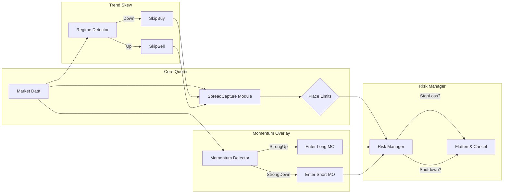

# Refactoring PRD: Multi-Layered Market Maker Strategy

## 1. Purpose
Ensure the `MarketMaker` strategy provides robust spread capture, directional biasing, momentum overlay, and drawdown protection in both up and down markets.

---

## 2. Proposed Features

### 2.1 Symmetric Spread-Capture Core
• **Objective**: Always quote both sides to earn bid-ask spread.  
• **Description**: Factor existing two-sided limit-order logic into a reusable module.

### 2.2 Trend-Based Quote Skew
• **Objective**: Bias quotes towards market trend.  
• **Description**: Detect up/down trends via ADX+autocorr; suppress or widen the contra-side orders in trending regimes.  
• **Implementation**:  
  - Flag up/down trend in `detect_market_regime()`.  
  - In `_compute_order_params()`, if downtrend → skip buy; if uptrend → skip sell.

### 2.3 Momentum Trading Overlay
• **Objective**: Capture directional moves.  
• **Description**: Enter market orders in strong momentum regimes (e.g. RSI extreme, MA crossover).  
• **Implementation**:  
  - Add momentum rules in `on_bar()` or `on_quote_tick()`.  
  - Track momentum fills separately from spread PnL.

### 2.4 Stop-Loss on Inventory
• **Objective**: Limit drawdown on net positions.  
• **Description**: Flatten inventory if unrealized loss exceeds `stop_loss_pct`.  
• **Implementation**:  
  - Track `avg_fill_price`.  
  - In `handle_order_filled()`, update average cost.  
  - In `on_quote_tick()/on_bar()`, compute unrealized and flatten if threshold exceeded.

### 2.5 Emergency Quoting Shutdown
• **Objective**: Cease quoting during extreme price drops.  
• **Description**: Disable refresh/orders if price falls > `drawdown_pct` within `drawdown_window_s`.  
• **Implementation**:  
  - Maintain deque of mid_prices in `update_market_metrics()`.  
  - In `refresh_orders()`, skip if shutdown condition met.

### 2.6 Configuration & Toggles
| Flag                      | Default  | Description                                       |
|---------------------------|----------|---------------------------------------------------|
| `enable_trend_skew`       | true     | Enable trend-based quote bias.                    |
| `enable_momentum`         | true     | Enable directional momentum trades.               |
| `enable_stop_loss`        | true     | Enable stop-loss flattening.                      |
| `enable_shutdown`         | true     | Enable emergency shutdown on drawdowns.           |
| `drawdown_pct`            | 0.02     | Shutdown threshold (percent drop).                |
| `drawdown_window_s`       | 300      | Lookback window in seconds.                       |
| `stop_loss_pct`           | 0.01     | Stop-loss threshold for unrealized loss.          |
| `trend_adx_threshold`     | 25.0     | ADX threshold to define trending.                 |
| `autocorr_threshold`      | -0.2     | Autocorrelation threshold for mean reversion.     |
| `momentum_rsi_upper`      | 70       | RSI level for overbought conditions.              |
| `momentum_rsi_lower`      | 30       | RSI level for oversold conditions.                |

---

## 3. Implementation Details

| Feature               | Methods to Update                                       | Config Fields                                                             |
|-----------------------|---------------------------------------------------------|-----------------------------------------------------------------------------|
| Spread Capture Core   | `_compute_order_params`, `_submit_orders`, `refresh_orders` | (existing)                                                                  |
| Trend Skew            | `detect_market_regime`, `_compute_order_params`         | `enable_trend_skew`, `trend_adx_threshold`, `autocorr_threshold`            |
| Momentum Overlay      | `on_bar`, `on_quote_tick`                               | `enable_momentum`, `momentum_rsi_upper`, `momentum_rsi_lower`               |
| Stop-Loss             | `handle_order_filled`, `on_quote_tick`, `on_bar`        | `enable_stop_loss`, `stop_loss_pct`                                         |
| Shutdown              | `update_market_metrics`, `refresh_orders`               | `enable_shutdown`, `drawdown_pct`, `drawdown_window_s`                      |

---

## 4. Acceptance Criteria

1. Core spread capture runs continuously and generates positive spread PnL over range markets.  
2. In trending backtests, the strategy biases quotes correctly (skips appropriate side).  
3. Momentum trades capture directional moves without breaking core quoting.  
4. Stop-loss flattens positions within one tick/bar if PnL breach occurs.  
5. Shutdown halts all quotes during extreme drawdowns and resumes after mean reversion.

---

## 5. Impacted Files & Components

- `src/strategies/market_maker/strategy.py`  
- `src/strategies/market_maker/config.yaml`  

---

## 6. Next Steps

1. Extend `MarketMakerConfig` with new flags and thresholds.  
2. Refactor current quoting logic into `spread_capture.py`.  
3. Implement trend-skew in regime detection and order parameter computation.  
4. Add momentum overlay handlers.  
5. Build risk manager for stop-loss and shutdown.  
6. Update config YAML with defaults.  
7. Run backtest with main_backtest.py

---

## 7. Architecture Diagram

---

## 8. Step-by-Step Implementation

1. Create `src/strategies/market_maker/spread_capture.py` and migrate core quoting.  
2. Update `strategy.py` for config extensions, imports, and integration of new modules.  
3. Add trend detection flags and logic in `detect_market_regime()`.  
4. Implement momentum overlay handlers in `on_bar()`/`on_quote_tick()`.  
5. Integrate risk manager checks in `update_market_metrics()` and `refresh_orders()`.  
6. Update `config.yaml` with default values.  
7. Run backtests.
