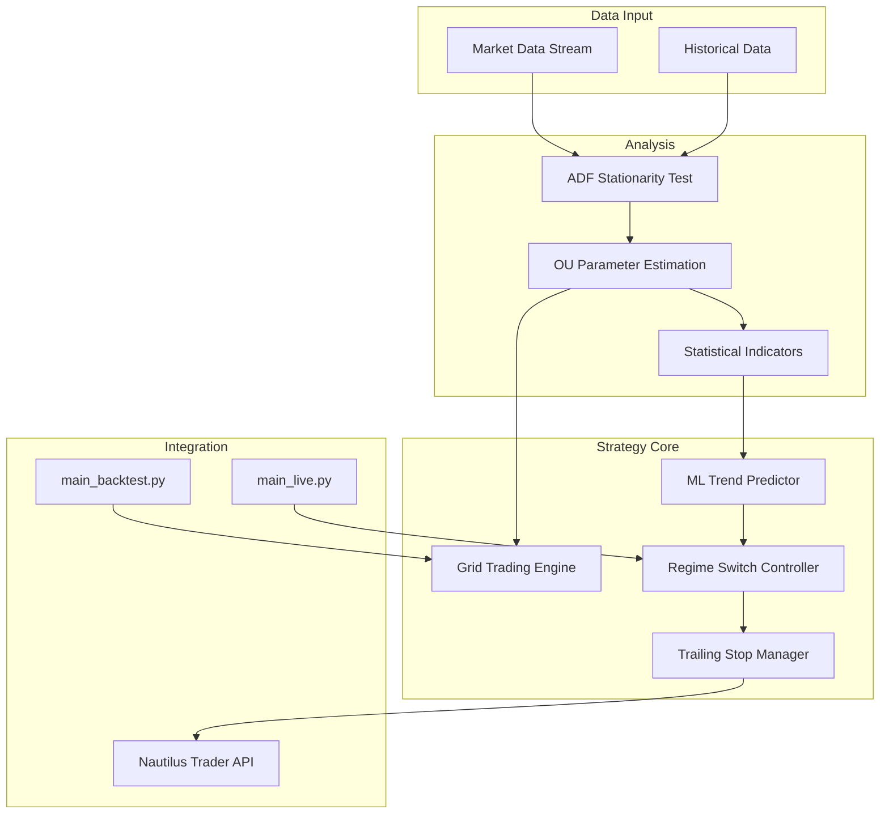

# Mean Reversion Strategy – Technical Developer Guide

## 1. Introduction
This technical guide provides a comprehensive overview of the Mean Reversion Strategy implementation for Nautilus Trader. It includes architecture, folder structure, code references, configuration, usage examples, and testing plan.

## 2. Architecture Overview


## 3. Folder Structure
```mermaid
tree
  .ai/spec/mean_reversion_strategy
  src/
    strategies/
      mean_reversion/
        config.yaml
        strategy.py
        ml_model.py
    main_backtest.py
    main_live.py
  tests/
    strategies/
      test_mean_reversion.py
```

## 4. Detailed Component Reference
- **Stationarity Detection**
  - File: [`strategy.py`](../../src/strategies/mean_reversion/strategy.py:1)
  - Function: `run_adf_test(window: int) → (p_value: float, statistic: float)`

- **Ornstein-Uhlenbeck Estimation**
  - File: [`strategy.py`](../../src/strategies/mean_reversion/strategy.py:1)
  - Function: `estimate_ou_parameters(window: int) → (theta: float, mu: float, sigma: float)`

- **Grid Trading Execution**
  - File: [`position_management.py`](../../src/strategies/position_management.py:1)
  - Class: `GridTrader`

- **Machine Learning Trend Prediction**
  - File: [`ml_model.py`](../../src/strategies/mean_reversion/ml_model.py:1)
  - Classes: `LogisticRegressionModel`, `DecisionTreeModel`

- **Regime Switching & Position Management**
  - File: [`strategy.py`](../../src/strategies/mean_reversion/strategy.py:1)
  - Logic: `if trend_predicted: switch_to_trend(trailing_stop_pct: float)`

- **Configuration & CLI Integration**
  - File: [`config.yaml`](../../src/strategies/mean_reversion/config.yaml:1)
  - CLI Flags in [`main_backtest.py`](../../src/main_backtest.py:1) and [`main_live.py`](../../src/main_live.py:1)

## 5. Code Module Mapping
| Feature                         | Module/File                                    |
|---------------------------------|------------------------------------------------|
| ADF Stationarity Test           | `strategy.py`                                  |
| OU Parameter Estimation         | `strategy.py`                                  |
| Grid Trading Engine             | `position_management.py`                       |
| ML Trend Predictor              | `ml_model.py`                                  |
| Regime Switch Controller        | `strategy.py`                                  |
| Trailing Stop Manager           | `position_management.py`                       |
| Configuration Reader            | `config.yaml`                                  |
| Backtest Entry Point            | `main_backtest.py`                             |
| Live Trading Entry Point        | `main_live.py`                                 |

## 6. Configuration Guide
All strategy parameters are exposed in `src/strategies/mean_reversion/config.yaml` under the `mean_reversion` section. Example:
```yaml
mean_reversion:
  lookback_window: 168          # hours
  positions_per_side: 3         # grid levels
  take_profit_std_dev_multiplier: 1.5
  stop_loss_std_dev_multiplier: 2.0
  ml_confidence_threshold: 0.6
  trailing_stop_pct: 0.005      # 0.5%
```
CLI Flags:
```
--strategy mean_reversion
--start-date YYYY-MM-DD
--end-date YYYY-MM-DD
--config-path path/to/config.yaml
```

## 7. Usage Examples
**Backtest**
```bash
python src/main_backtest.py \
  --strategy mean_reversion \
  --start-date 2024-01-01 \
  --end-date 2024-12-31
```

**Live Trading**
```bash
python src/main_live.py \
  --strategy mean_reversion \
  --config-path src/strategies/mean_reversion/config.yaml
```

## 8. Testing Plan
1. **Unit Tests**
   - Test `run_adf_test` with synthetic AR(1) data generating known p-values.
   - Test `estimate_ou_parameters` against simulated OU processes.
   - Located in [`tests/strategies/test_mean_reversion.py`](../../tests/strategies/test_mean_reversion.py:1)

2. **Integration Tests**
   - End-to-end backtest with deterministic sample data to verify outputs.

3. **Backtesting Scenarios**
   - Range-bound market simulation.
   - Trending market simulation.
   - Choppy market simulation.

4. **CI Pipeline**
   - Automate with GitHub Actions or other CI to run tests on each commit.

## 9. Next Steps & References
- Link this guide from [`docs/strategies.md`](../../../docs/strategies.md:1)
- Update example notebooks under `notebooks/`
- Performance tuning and monitoring configuration in subsequent iterations.