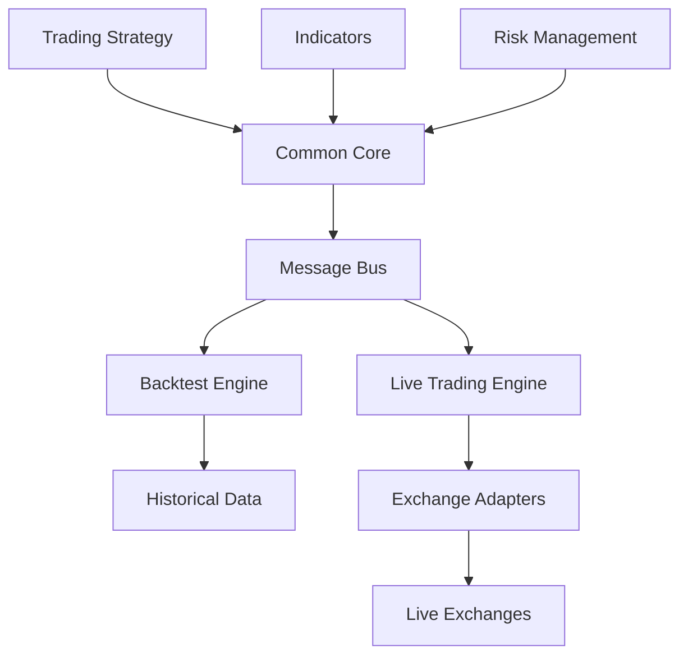
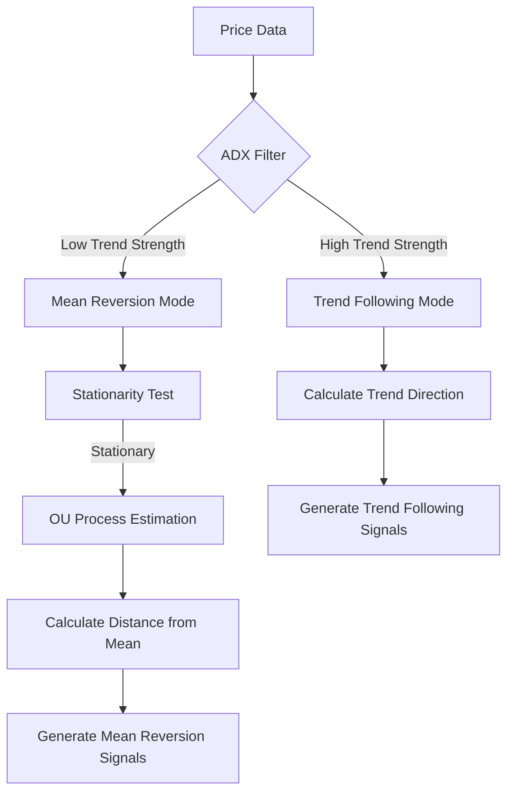

<div class="flex justify-center">
  
</div>

# Nautilus Playground

A cohesive environment for prototyping, testing, and demonstrating trading strategies

<div class="pt-12">
  <span @click="$slidev.nav.next" class="px-2 py-1 rounded cursor-pointer" hover="bg-white bg-opacity-10">
    Press Space for next page <carbon:arrow-right class="inline"/>
  </span>
</div>

<div class="abs-br m-6 flex gap-2">
  <a href="https://github.com/nautechsystems/nautilus" target="_blank" alt="GitHub"
    class="text-xl slidev-icon-btn opacity-50 !border-none !hover:text-white">
    <carbon-logo-github />
  </a>
</div>

---
layout: default
---

# What is Nautilus Trader?

<v-clicks>

- **Open-source** high-performance algorithmic trading platform
- **Production-grade** system for backtesting and live trading
- **AI-first** design for developing and deploying trading strategies
- **Core written in Rust** with Python bindings for performance and safety
- **Universal and asset-class-agnostic** supporting multiple venues simultaneously

</v-clicks>

<div class="grid grid-cols-2 gap-4 mt-8">
<div>
<v-click>

## Key Features

</v-click>

<v-clicks>

- **Fast**: Core in Rust with async networking
- **Reliable**: Type and thread safety
- **Portable**: OS independent (Linux, macOS, Windows)
- **Flexible**: Modular adapter architecture
- **Advanced**: Sophisticated order types and execution

</v-clicks>
</div>

<div>
<v-click>

## Architecture

</v-click>

<v-clicks>

- Event-driven design
- Message bus for component communication
- Domain-driven design principles
- Ports and adapters pattern
- Crash-only design philosophy

</v-clicks>
</div>
</div>

---
layout: default
---

# Nautilus Trader Architecture

<div class="grid grid-cols-2 gap-4">
<div>

<v-clicks>

## Environment Contexts

- **Backtest**: Historical data with simulated venues
- **Sandbox**: Real-time data with simulated venues
- **Live**: Real-time data with live venues

## Common Core

- Shared code between all environments
- Modular components with clean interfaces
- Efficient `MessageBus` for communication
- Single-thread design for optimal performance

</v-clicks>

</div>
<div>

<v-click>



</v-click>

</div>
</div>

---
layout: default
---

# Nautilus Trader Technical Details

<div class="grid grid-cols-2 gap-4">
<div>

<v-click>

## Data Types

</v-click>

<v-clicks>

- `OrderBookDelta` (L1/L2/L3)
- `OrderBookDepth10`
- `QuoteTick`
- `TradeTick`
- `Bar`
- `Instrument`
- `InstrumentStatus`

</v-clicks>

<v-click>

## Bar Aggregations

</v-click>

<v-clicks>

- Time-based: `MILLISECOND` to `MONTH`
- Volume-based: `TICK`, `VOLUME`, `VALUE`
- Advanced: `IMBALANCE`, `RUNS`

</v-clicks>

</div>
<div>

<v-click>

## Order Types

</v-click>

<v-clicks>

- `MARKET`
- `LIMIT`
- `STOP_MARKET`
- `STOP_LIMIT`
- `MARKET_TO_LIMIT`
- `MARKET_IF_TOUCHED`
- `LIMIT_IF_TOUCHED`
- `TRAILING_STOP_MARKET`
- `TRAILING_STOP_LIMIT`

</v-clicks>

<v-click>

## Account Types

</v-click>

<v-clicks>

- `Cash` (single/multi-currency)
- `Margin` (single/multi-currency)
- `Betting` (single-currency)

</v-clicks>

</div>
</div>

---
layout: default
---

# Nautilus Trader Strategy Example

<div class="grid grid-cols-2 gap-4">
<div>

<v-clicks>

## Strategy Implementation

- Strategies inherit from `Strategy` class
- Configuration via `StrategyConfig`
- Event-driven architecture
- Handlers for market data and events
- Built-in position management
- Comprehensive indicator framework

</v-clicks>

</div>
<div>

<v-click>

```python {monaco}
class MACDStrategy(Strategy):
    def __init__(self, config: MACDConfig):
        super().__init__(config=config)
        # Initialize MACD indicator
        self.macd = MovingAverageConvergenceDivergence(
            fast_period=config.fast_period,
            slow_period=config.slow_period,
            price_type=PriceType.MID
        )
        self.position = None

    def on_start(self):
        # Subscribe to market data
        self.subscribe_quote_ticks(self.config.instrument_id)

    def on_quote_tick(self, tick: QuoteTick):
        # Update indicator with new data
        self.macd.handle_quote_tick(tick)

        if not self.macd.initialized:
            return  # Wait for indicator warmup

        # Trading logic
        if self.macd.value > 0.0001:  # Buy signal
            self.buy()
        elif self.macd.value < -0.0001:  # Sell signal
            self.sell()
```

</v-click>

</div>
</div>

---
layout: default
---

# What is Nautilus Playground?

A self-contained environment for algorithmic trading development using the Nautilus Trader framework

<v-clicks>

- **Develop** and test trading strategies
- **Backtest** strategies with historical data
- **Run** live trading simulations
- **Explore** and visualize trading results
- **Learn** algorithmic trading concepts

</v-clicks>

<div class="mt-12"></div>

<v-click>

## Key Features

</v-click>

<v-clicks>

- 📊 Comprehensive backtesting framework
- 🧪 Strategy development environment
- 🔄 Live trading capabilities
- 📈 Data visualization tools
- 🐳 Docker-based development environment

</v-clicks>

---
layout: default
---

# Tooling & Libraries for Quants and Data Scientists

<div class="grid grid-cols-2 gap-4">
<div>

<v-click>

## Data Analysis & ML Libraries

</v-click>

<v-clicks>

- **pandas**, **numpy**, **scipy** - Core data analysis
- **pandas-ta** - 130+ technical indicators
- **statsmodels** - Statistical models, tests, and analysis
- **scikit-learn**, **xgboost**, **tensorflow** - Machine learning
- **pytorch**, **ray** - Deep learning and distributed computing
- **prophet**, **darts** - Time series forecasting
- **QuantStats** - Portfolio analytics and performance metrics

</v-clicks>

<v-click>

## Visualization Tools

</v-click>

<v-clicks>

- **matplotlib**, **seaborn** - Static visualizations
- **plotly**, **bokeh** - Interactive charts
- **mplfinance** - Financial charting
- **panel**, **hvplot** - Interactive dashboards
- **altair** - Declarative statistical visualization

</v-clicks>

</div>
<div>

<v-click>

## Developer Productivity

</v-click>

<v-clicks>

- **VS Code** with Python, Jupyter, and GitHub Copilot extensions
- **JupyterLab** - Interactive computing environment
- **Neovim with NvChad** - Advanced text editor
- **Docker** - Containerized development environment
- **Git** - Version control
- **pytest** - Testing framework
- **black**, **isort** - Code formatting
- **pylint** - Code linting

</v-clicks>

<v-click>

## Specialized Trading Tools

</v-click>

<v-clicks>

- **Ornstein-Uhlenbeck process modeling** - For mean reversion
- **Augmented Dickey-Fuller test** - For stationarity testing
- **pandas_market_calendars** - Trading calendar management
- **py_vollib** - Options volatility calculations
- **pyfolio-reloaded** - Portfolio and risk analytics
- **hurst** - Hurst exponent for time series analysis

</v-clicks>

</div>
</div>

---
layout: two-cols
---

# Project Structure

<v-clicks>

- `.devcontainer/`: Development container configuration
- `data/`: Data files for backtesting
  - `catalog/`: Local data catalog
- `docs/`: Project documentation
- `notebooks/`: Jupyter notebooks
- `scripts/`: Utility scripts
- `src/`: Source code
  - `execution/`: Execution algorithms
  - `indicators/`: Technical indicators
  - `strategies/`: Trading strategies
- `tests/`: Unit and integration tests

</v-clicks>

::right::

<div class="ml-4">
<v-click>

## Development Environment

</v-click>

<v-clicks>

- Based on Docker container
- VS Code integration
- Pre-installed libraries:
  - nautilus_trader
  - pandas, numpy, scipy
  - matplotlib, plotly, seaborn
  - scikit-learn, xgboost, tensorflow
  - And many more...

</v-clicks>

<v-click>

## Getting Started

</v-click>

<v-clicks>

```bash
# Clone the repository
git clone https://github.com/your-repo/nautilus-playground.git

# Open in VS Code and reopen in container
```

</v-clicks>
</div>

---
layout: default
---

# Trading Strategies

<v-clicks>

The project includes two main trading strategies:

</v-clicks>

<div class="grid grid-cols-2 gap-4 mt-4">
  <v-click>
    <StrategyCard
      name="Moving Average Crossover"
      description="A simple yet effective strategy based on EMA crossovers."
      :features="[
        'Generates buy signals when fast EMA crosses above slow EMA',
        'Generates sell signals when fast EMA crosses below slow EMA',
        'Configurable parameters: fast/slow periods, trade size'
      ]"
    />
  </v-click>

  <v-click>
    <StrategyCard
      name="Mean Reversion with ADX Filter"
      description="A sophisticated strategy combining statistical methods and machine learning."
      :features="[
        'Uses ADX to determine trend strength',
        'Applies mean reversion in range-bound markets',
        'Applies trend following in trending markets',
        'Uses Ornstein-Uhlenbeck process to model price movements',
        'Includes machine learning enhancements'
      ]"
    />
  </v-click>
</div>

---
layout: default
---

# Moving Average Crossover Strategy

<div class="grid grid-cols-2 gap-4">
<div>

<v-clicks>

- Simple yet effective strategy
- Based on two Exponential Moving Averages (EMAs)
- Trading signals generated at crossovers
- Implemented in `src/strategies/moving_average_crossover/`

</v-clicks>

</div>
<div>

<v-click>

```python {monaco}
from nautilus_trader.model.enums import OrderSide
from nautilus_trader.trading.strategy import Strategy

class MovingAverageCrossover(Strategy):
    def __init__(self, config):
        self.fast_ema = PandasTaIndicator(
            bar_type=self.bar_type,
            indicator_name="ema",
            params={"length": self.fast_ema_period},
        )

        self.slow_ema = PandasTaIndicator(
            bar_type=self.bar_type,
            indicator_name="ema",
            params={"length": self.slow_ema_period},
        )
```

</v-click>

</div>
</div>

<v-click>

## Signal Logic

</v-click>

<div class="grid grid-cols-2 gap-4">
<div>

<v-clicks>

- **Buy Signal**: Fast EMA crosses above Slow EMA
- **Sell Signal**: Fast EMA crosses below Slow EMA
- Position management with market orders
- Configurable trade size and EMA periods

</v-clicks>

</div>
<div>

<v-click>

```python {monaco}
# Check for bullish crossover (fast crosses above slow)
if (self.previous_fast_ema <= self.previous_slow_ema and
    current_fast_ema > current_slow_ema):
    self._log.info("Bullish crossover detected")
    self._handle_signal(OrderSide.BUY)

# Check for bearish crossover (fast crosses below slow)
elif (self.previous_fast_ema >= self.previous_slow_ema and
      current_fast_ema < current_slow_ema):
    self._log.info("Bearish crossover detected")
    self._handle_signal(OrderSide.SELL)
```

</v-click>

</div>
</div>

---
layout: default
---

# Mean Reversion Strategy

<div class="grid grid-cols-2 gap-4">
<div>

<v-clicks>

- Sophisticated strategy combining multiple approaches
- Uses ADX (Average Directional Index) as trend filter
- Applies statistical tests for mean reversion
- Implements Ornstein-Uhlenbeck process modeling
- Includes machine learning for signal enhancement

</v-clicks>

</div>
<div>

<v-click>



</v-click>

</div>
</div>

<v-click>

## Strategy Components

</v-click>

<v-clicks>

- **ADX Filter**: Determines market regime (trending vs. range-bound)
- **Stationarity Testing**: Augmented Dickey-Fuller test
- **OU Process**: Models mean-reverting behavior
- **Position Management**: Adaptive take-profit and stop-loss levels
- **Machine Learning**: Enhances entry/exit decisions

</v-clicks>

---
layout: default
---

# Technical Indicators

<v-click>

## PandasTaIndicator

</v-click>

<v-clicks>

- Wrapper for the pandas-ta library
- Provides access to 130+ technical indicators
- Seamlessly integrates with Nautilus Trader
- Located in `src/indicators/pandas_ta_indicator.py`

</v-clicks>

<div class="grid grid-cols-2 gap-4 mt-4">
<div>

<v-click>

### Supported Indicator Types

</v-click>

<v-clicks>

- **Trend Indicators**: ADX, MACD, Moving Averages
- **Momentum Indicators**: RSI, Stochastic, CCI
- **Volatility Indicators**: Bollinger Bands, ATR
- **Volume Indicators**: OBV, MFI
- **And many more...**

</v-clicks>

</div>
<div>

<v-click>

```python {monaco}
# Create an RSI indicator
rsi = PandasTaIndicator(
    bar_type=bar_type,
    indicator_name="rsi",
    params={"length": 14},
    price_type=PriceType.LAST,
)

# Create an ADX indicator
adx = PandasTaIndicator(
    bar_type=bar_type,
    indicator_name="adx",
    params={"length": 14},
    price_type=PriceType.LAST,
)
```

</v-click>

</div>
</div>

---
layout: default
---

# Execution Algorithms

<v-click>

## TWAP (Time-Weighted Average Price)

</v-click>

<v-clicks>

- Executes orders over a specified time period
- Aims to achieve a price close to the time-weighted average
- Minimizes market impact for large orders
- Located in `src/execution/twap.py`

</v-clicks>

<div class="grid grid-cols-2 gap-4 mt-4">
<div>

<v-click>

### How TWAP Works

</v-click>

<v-clicks>

1. Divides the order into smaller chunks
2. Executes these chunks at regular intervals
3. Reduces market impact and slippage
4. Useful for large orders in less liquid markets

</v-clicks>

</div>
<div>

<v-click>

```python {monaco}
class TWAP(ExecutionAlgorithm):
    def __init__(
        self,
        instrument_id: InstrumentId,
        order_side: OrderSide,
        quantity: Quantity,
        start_time: pd.Timestamp,
        end_time: pd.Timestamp,
        interval_minutes: int = 5,
    ):
        # Initialize TWAP parameters
        self.start_time = start_time
        self.end_time = end_time
        self.interval_minutes = interval_minutes
        self.intervals = self._calculate_intervals()
```

</v-click>

</div>
</div>

---
layout: default
---

# Jupyter Notebooks

<v-clicks>

The project includes Jupyter notebooks for exploring and demonstrating strategies:

</v-clicks>

<v-click>

## 1. Moving Average Crossover Backtest

</v-click>

<v-clicks>

- Located in `notebooks/moving_average_crossover_backtest.ipynb`
- Demonstrates backtesting and optimizing the strategy
- Includes performance analysis and visualization

</v-clicks>

<v-click>

## 2. Mean Reversion Strategy Exploration

</v-click>

<v-clicks>

- Located in `notebooks/mean_reversion_strategy_exploration.ipynb`
- Explores mean reversion characteristics in price data
- Tests for stationarity using Augmented Dickey-Fuller test
- Estimates Ornstein-Uhlenbeck process parameters
- Visualizes mean reversion opportunities
- Analyzes performance metrics

</v-clicks>

---
layout: default
---

# Backtesting

<v-clicks>

Run backtests using the `main_backtest.py` script:

```bash
# First download the required data
python scripts/download_data.py --symbols BTCUSDT --timeframes 1h 1d --days 90

# Then run the backtest
python src/main_backtest.py --config path/to/config.yaml
```

Specify date ranges:

```bash
python src/main_backtest.py --config path/to/config.yaml --start-date 2023-01-01 --end-date 2023-12-31
```

</v-clicks>

<v-click>

## Backtest Configuration

</v-click>

<v-clicks>

- Configure strategies using YAML files
- Set parameters like trade size, indicator periods, etc.
- Specify instruments and timeframes
- Define risk management parameters

</v-clicks>

---
layout: default
---

# Live Trading

<v-clicks>

Run live trading using the `main_live.py` script:

```bash
# For live trading
python src/main_live.py

# For paper trading (using Binance testnet)
python src/main_live.py --paper

# With custom configuration
python src/main_live.py --config path/to/config.yaml
```

</v-clicks>

<v-click>

## Setup Requirements

</v-click>

<v-clicks>

1. Create a `.env` file with your API credentials
2. Configure the strategy parameters
3. Start the trading node
4. Monitor performance in real-time

</v-clicks>

<v-click>

## Supported Exchanges

</v-click>

<v-clicks>

- Binance (Spot, Margin, Futures)
- More exchanges can be added through Nautilus Trader adapters

</v-clicks>

---
layout: center
class: text-center
---

<div class="flex justify-center">
  
</div>

# Thank You!

[GitHub Repository](https://github.com/your-repo/nautilus-playground) · [Documentation](https://your-docs-url.com)

<div class="pt-12">
  <span @click="$slidev.nav.next" class="px-2 py-1 rounded cursor-pointer" hover="bg-white bg-opacity-10">
    Press Space for next page <carbon:arrow-right class="inline"/>
  </span>
</div>

<div class="abs-br m-6 flex gap-2">
  <a href="https://github.com/nautechsystems/nautilus" target="_blank" alt="GitHub"
    class="text-xl slidev-icon-btn opacity-50 !border-none !hover:text-white">
    <carbon-logo-github />
  </a>
</div>
